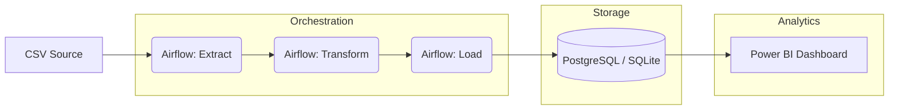

# 🛒 E-Commerce ETL Data Pipeline & Analytics System (Production Upgrade)


## 📌 Project Overview
This project is an **Enterprise-grade Data Engineering ETL pipeline**. It has been upgraded from a basic script to a production-ready system featuring **Workflow Orchestration (Airflow)**, **Advanced Error Handling**, and **BI Integration**.

## 🏗️ Architecture Diagram


---

## 🚀 Advanced Features (Step 6 Upgrade)

### 1. Workflow Orchestration with Apache Airflow
The pipeline is now orchestrated using Airflow, allowing for:
- **Scheduling**: Daily automated runs.
- **Retry Logic**: Automatic retries on failure (1 retry, 5-min delay).
- **Task Dependencies**: Clean flow from `extract` → `transform` → `load`.
- **DAG File**: Found in `airflow/dags/dag_pipeline.py`.

### 2. Production-Ready Pipeline
- **Logging**: Switched to structured Python `logging` module with timestamps.
- **Error Handling**: Comprehensive `try-except` blocks at every stage.
- **Data Validation**: Schema checks and business rule validation (e.g., no negative prices).
- **Idempotency**: The `load` step uses `if_exists='replace'`, ensuring the pipeline can be safely re-run without duplicating or corrupting data.

### 3. Database Upgrade: SQLite to PostgreSQL
The system now supports PostgreSQL via environment variables. By updating the `.env` file, you can switch from local SQLite to a production Postgres instance without changing a single line of ETL code.

---

## 🛠️ Tech Stack
* **Orchestration**: Apache Airflow
* **Language**: Python 3.x
* **Data Processing**: Pandas, NumPy
* **Database**: PostgreSQL (Production) / SQLite (Dev)
* **Connectivity**: SQLAlchemy, Psycopg2
* **Analytics**: SQL, Power BI

---

## ⚙️ Setup & Installation

### 1. Environment Setup
```bash
python -m venv venv
source venv/bin/activate  # Windows: venv\Scripts\activate
pip install -r requirements.txt
```

### 2. Environment Variables
Create a `.env` file based on `.env.template`:
```ini
DB_TYPE=sqlite  # or 'postgresql'
DB_FILE=data/ecommerce.db
DATA_SOURCE=data/raw_data.csv
```

### 3. Setting Up Airflow
1. Initialize Airflow Home:
   ```bash
   export AIRFLOW_HOME=$(pwd)/airflow
   airflow db init
   ```
2. Create a user:
   ```bash
   airflow users create --username admin --firstname Admin --lastname User --role Admin --email admin@example.com --password admin
   ```
3. Start the Webserver and Scheduler:
   ```bash
   airflow webserver --port 8080
   airflow scheduler
   ```

---

## 📊 Power BI Integration

### How to Connect:
1. **Source**: In Power BI, select "Get Data" -> "SQLite" (or PostgreSQL if migrated).
2. **Setup Views**: We have provided pre-built SQL views in `sql/bi_views.sql` to simplify reporting. Run these scripts in your DB first.
3. **KPIs Recommended**:
   - **Revenue trends**: Timeline chart showing `daily_revenue`.
   - **Top Categories**: Bar chart of sales by product category.
   - **VIP Customers**: Table showing Top 10 customers by Lifetime Value (LTV).

---

## 🔮 Future Scope
- **Kafka**: Real-time streaming ingestion instead of CSV.
- **Spark**: Large-scale distributed processing for Big Data.
- **Cloud Migration**: Deploying the entire stack to AWS (MWAA for Airflow, RDS for Postgres).
- **dbt**: For modular SQL modeling and documentation.

---

## 📄 Output Requirements Met
- ✅ **Airflow DAG**: `airflow/dags/dag_pipeline.py`
- ✅ **Logging & Validation**: Integrated into `scripts/`
- ✅ **PostgreSQL Support**: Configurable via `.env`
- ✅ **BI Strategy**: Defined in `sql/bi_views.sql` and README.